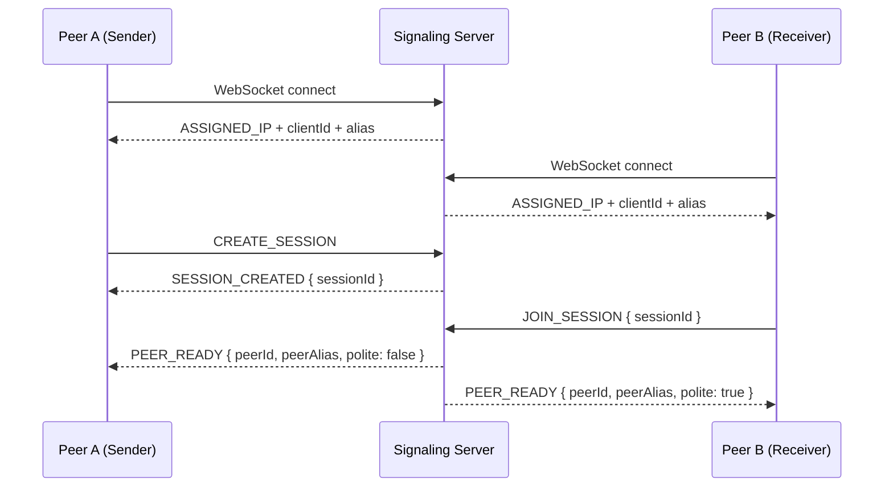
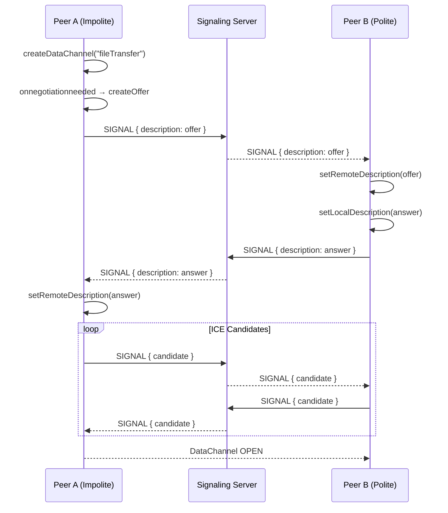
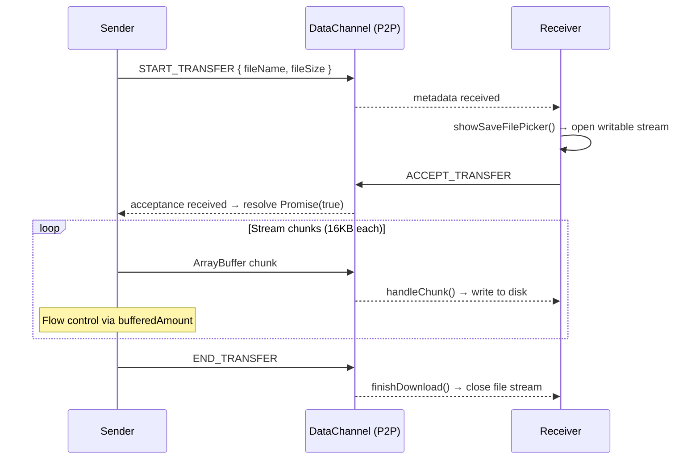

# ShareLink – Secure P2P File Sharing

ShareLink is a **real-time, peer-to-peer file sharing web app** built with **WebRTC**, enabling direct device-to-device file transfer — no server storage, no upload wait times.

---

## Features

| Feature | Description |
|---|---|
| P2P Transfer | Direct WebRTC DataChannel streaming |
| No Server Storage | Files never touch the signaling server |
| E2E Encrypted | DTLS encryption built into WebRTC |
| Cross-Network | TURN relay support for NAT traversal |
| Large File Support | GB-level streaming with smart buffering |
| Auto Reconnect | Session persistence via localStorage |
| Real-time Chat | In-session messaging over DataChannel |
| Audio Calls | Optional voice call between peers |

---

## Architecture Overview

```text
┌─────────────────────────────────────────────────────────────────┐
│                        Browser (Peer A)                         │
│   Next.js Frontend  ──►  FileTransferManager  ──►  RTCPeerConn  │
└─────────────────────────────┬───────────────────────────────────┘
                              │  WebSocket (Signaling only)
                              ▼
┌─────────────────────────────────────────────────────────────────┐
│                  WebSocket Signaling Server                      │
│           (Node.js — routes offer/answer/ICE only)              │
└─────────────────────────────┬───────────────────────────────────┘
                              │  WebSocket (Signaling only)
                              ▼
┌─────────────────────────────────────────────────────────────────┐
│                        Browser (Peer B)                         │
│   Next.js Frontend  ──►  FileTransferManager  ──►  RTCPeerConn  │
└─────────────────────────────────────────────────────────────────┘
                              │
              ┌───────────────┴───────────────┐
              ▼                               ▼
     Direct P2P (STUN)              TURN Relay (if NAT blocked)
```

<Callout type="info">
  The signaling server only handles **connection setup** (SDP offer/answer + ICE candidates). Once the WebRTC handshake completes, **all data flows directly peer-to-peer** — the server is no longer involved.
</Callout>

---

## Connection Workflow

The full lifecycle from page load to completed file transfer:

### Phase 1 — Signaling & Session Setup



### Phase 2 — WebRTC Handshake (Perfect Negotiation)



### Phase 3 — File Transfer Protocol



---

## Project Structure

```
ShareLink/
├── client/                     # Next.js frontend
│   ├── app/
│   │   └── page.jsx            # Entry point
│   ├── components/
│   │   ├── VaultChat.component.jsx      # Main chat + transfer UI
│   │   └── FileMessage.component.jsx   # File card with progress
│   ├── hooks/
│   │   └── useVault.hook.js    # All state + WebSocket + RTC logic
│   ├── lib/
│   │   └── webrtc.js           # FileTransferManager class
│   └── .env                    # NEXT_PUBLIC_WS_URL
│
└── server/
    └── server.js               # WebSocket signaling server
```

---

## Setup & Installation

<Steps>

### Clone the repository

```bash
git clone https://github.com/Bharat346/ShareLink.git
cd ShareLink
```

### Install dependencies

```bash
npm install
```

### Configure environment variables

Create a `.env` file in the client root:

<Tabs>
  <Tab label="Development">
    ```env
    NEXT_PUBLIC_WS_URL=ws://localhost:4000/signaling
    ```
  </Tab>
  <Tab label="Production">
    ```env
    NEXT_PUBLIC_WS_URL=wss://your-backend-url/signaling
    ```
  </Tab>
</Tabs>

### Start the signaling server

```bash
node server.js
# Server listening on ws://localhost:4000/signaling
```

### Start the frontend

```bash
npm run dev
# App running on http://localhost:3000
```

</Steps>

---

## Core Modules

### `FileTransferManager` (`lib/webrtc.js`)

The heart of the application. Manages the entire WebRTC lifecycle.

```js
const manager = new FileTransferManager(
  (message, type) => addLog(message, type),   // onLog
  (status, details) => handleStatus(status),  // onStatus
  (percent) => setProgress(percent),          // onProgress
);

manager.initPeerConnection(sendSignalFn, polite);
```

**Key responsibilities:**

| Method | Description |
|---|---|
| `initPeerConnection(sendSignal, polite)` | Sets up RTCPeerConnection + DataChannel with perfect negotiation |
| `sendFile(file)` | Streams file in 16KB chunks with backpressure control |
| `prepareForDownload(metadata)` | Opens File System Access API writable stream |
| `handleChunk(data)` | Writes incoming ArrayBuffer chunks to disk |
| `finishDownload()` | Closes file stream after `END_TRANSFER` |
| `sendChat(message, alias)` | Sends chat message over DataChannel |
| `toggleAudioCall(enabled, cb)` | Adds/removes audio tracks to PeerConnection |

### `useVaultHook` (`hooks/useVault.hook.js`)

React hook that wires together WebSocket signaling, WebRTC, and UI state.

```js
const {
  status,          // disconnected | connecting | connected | transferring | downloading
  messages,        // chat + file-request messages
  sendChatMessage,
  handleFileSelect,
  acceptFile,
  rejectFile,
  progress,        // 0–100
  alias,           // local peer name
  peerAlias,       // remote peer name
  sessionId,
  startSession,
  joinSession,
} = useVaultHook();
```

<Callout type="warning">
  `handleRTCStatus` is passed as a callback into `FileTransferManager` at `initRTC` time, creating a closure. Always use **refs** (not state) for values read inside this callback — state values will be stale.
</Callout>

---

## Security Model

```
┌──────────────────────────────────────────┐
│           Security Layers                │
│                                          │
│  ┌────────────────────────────────────┐  │
│  │  DTLS 1.2  (WebRTC built-in)       │  │  ← Mandatory encryption
│  └────────────────────────────────────┘  │
│  ┌────────────────────────────────────┐  │
│  │  SRTP  (for audio tracks)          │  │  ← Audio encryption
│  └────────────────────────────────────┘  │
│  ┌────────────────────────────────────┐  │
│  │  No Server Storage                 │  │  ← Zero data at rest
│  └────────────────────────────────────┘  │
│  ┌────────────────────────────────────┐  │
│  │  Session ID  (join gate)           │  │  ← Access control
│  └────────────────────────────────────┘  │
└──────────────────────────────────────────┘
```

<Callout type="warning">
  ⚠️ In **Fast Mode** (direct P2P via STUN), your IP address is visible to the remote peer. Use **Private Mode** (TURN relay) to hide your IP.
</Callout>

---

## ⚡ Transfer Modes

| Mode | How | Speed | Privacy |
|---|---|---|---|
| **Fast Mode** | Direct P2P via STUN | ⚡⚡⚡ Max | IP visible to peer |
| **Private Mode** | TURN relay server | ⚡⚡ Throttled | IP hidden |

---

## 🌐 TURN Server Configuration

```js
{
  urls: [
    "turn:free.expressturn.com:3478?transport=udp",
    "turn:free.expressturn.com:3478?transport=tcp"
  ],
  username: "YOUR_USERNAME",
  credential: "YOUR_PASSWORD"
}
```

<Callout type="info">
  Free TURN servers (ExpressTurn, OpenRelay) may throttle bandwidth. For production use, self-host a TURN server using [coturn](https://github.com/coturn/coturn).
</Callout>

---

## Known Limitations

| Limitation | Details |
|---|---|
| Browser Support | File System Access API requires Chrome/Edge 86+ |
| Safari | Limited WebRTC DataChannel support |
| Free TURN | Bandwidth throttled on free tier servers |
| Single peer | Currently 1:1 only (no multi-peer) |
| No resume | Interrupted transfers must restart from 0 |

---

## Roadmap

- [ ] **Resume interrupted transfers** — checkpoint-based chunking
- [ ] **Folder transfer** — zip on-the-fly or recursive directory support
- [ ] **AES encryption layer** — additional client-side encryption
- [ ] **Multi-peer sharing** — mesh or star topology
- [ ] **Privacy mode toggle** — force TURN-only in UI
- [ ] **Transfer analytics** — speed graph, ETA, per-chunk stats

---

## Contributing

Pull requests are welcome! Please open an issue first for major changes.

```bash
# Fork → Clone → Branch → PR
git checkout -b feature/your-feature
git commit -m "feat: add your feature"
git push origin feature/your-feature
```

---

## License

MIT License © [Bharat](https://github.com/Bharat346)

---